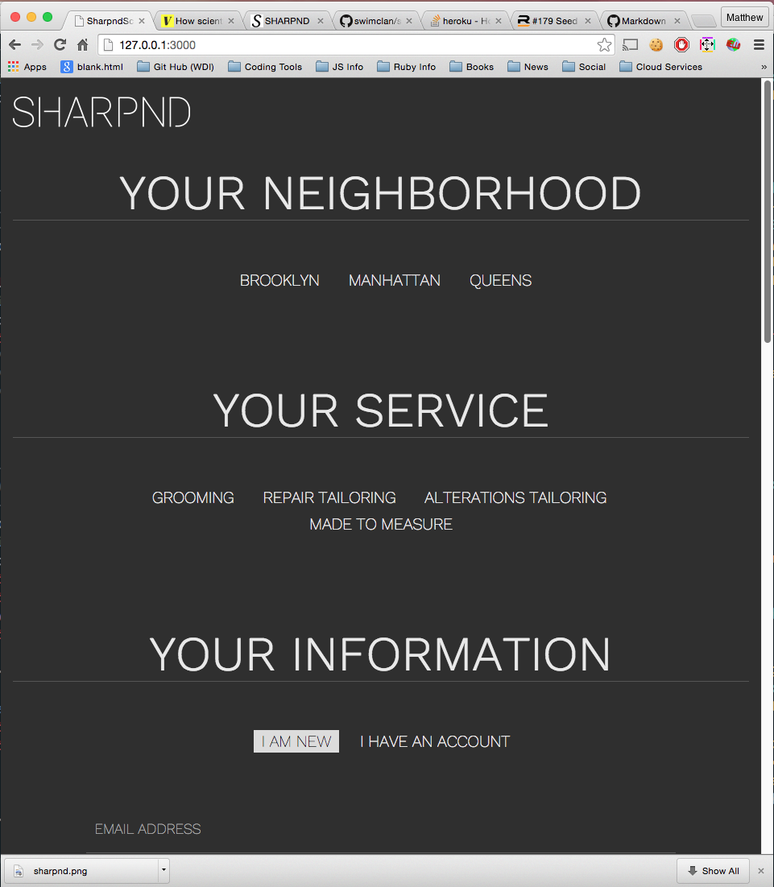
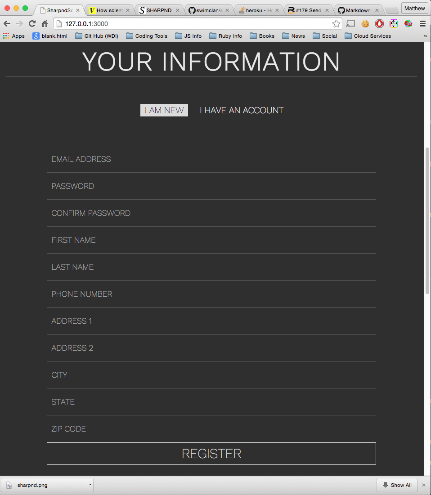
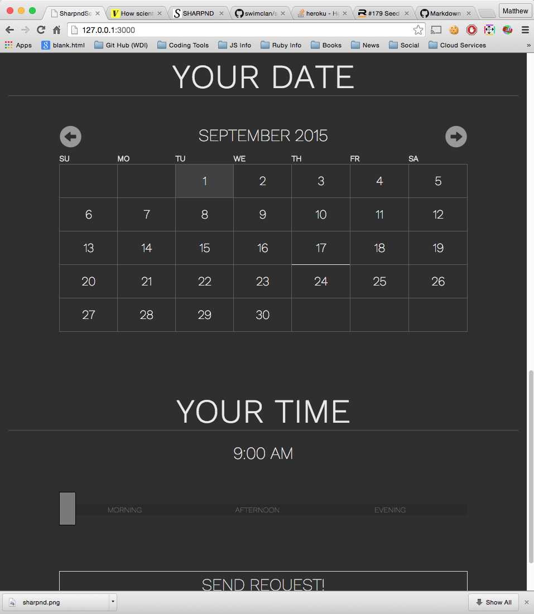
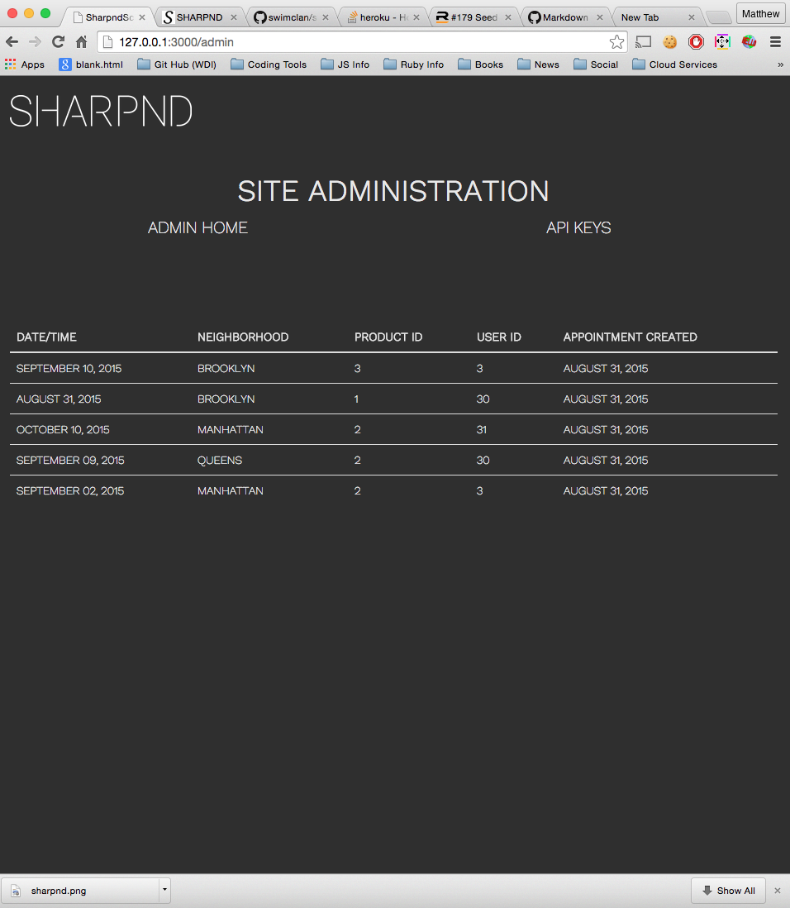
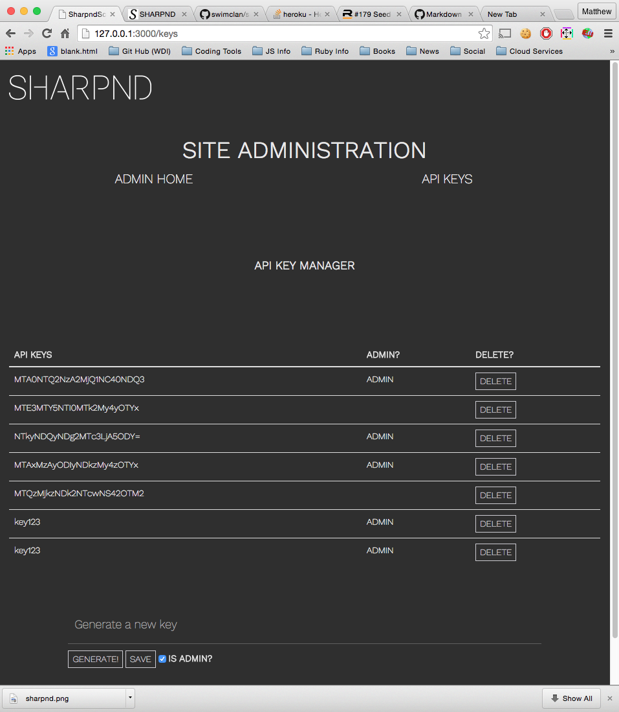

# Sharpnd Scheduler

This is an application that takes reservations for the online grooming service Sharpnd.com.  The app allows a user to select a neighborhood they live in, a service they are interested in, takes their information, allows them to log in, select a date and a time for the appointment.

Bundled with the application are two RESTful APIs: one for listing out the current set of appointments and one for the current products and services offered by Sharpnd.

Hosted version [is located here](http://sharpnd-scheduler.herokuapp.com)

## Installation Instructions

The Sharpnd Scheduler is [reposited on GitHub](https://github.com/swimclan/sharpnd_scheduler).

Here are the steps needed to install the application on your local machine or on a webserver:

1. Clone down the repository from GitHub using: `git clone https://github.com/swimclan/sharpnd_scheduler`

2. Its a Ruby on Rails application so you will need to run the following rake commands

	- `rake db:create` <-- Creates the database
	- `rake db:migrate` <-- Generates the tables and fields
	- `rake db:seed` <-- Inserts the first default API key into the table

	- These commands will create the appointments table, the users table and the products table.*

3. Install a Cookie on your browser with the default API key (using your favorite cookie editor, I use "EditThisCookie" Chrome extension)

	- The cookie key name must be `apiKey` (case sensitive)
	- The cookie value must be the default API key `key123`

4. Bundle the gems together to prepare for running the app by executing `bundle` on the terminal shell prompt from within the directory of the application that was cloned

5. Run the Rails app by executing `rails s` on the terminal shell prompt

6. Run the admin page by directing your browser to [http://localhost:3000/admin](http://localhost:3000/admin).

7. Navigate to 'API Keys'

8. Generate a new API key by clicking the `Generate` button and select `Admin?` checkbox to ensure that this new Key has admin rights.  Click `Save` to finalize the new API key

9. In your browser attach the newly generated key to your browser cookie (again, using EditThisCookie as an example)

10. Refresh the /keys page

11. Delete the default `key123` key by clicking `Delete` next to the default key.  This will ensure that the app is secured.

12. Run the app!  Navigate to [http://localhost:3000](http://localhost:3000)

## App Usage (User Stories)

### Neighborhood Selector
* Select the neighborhood you are in so the stylist or tailor know which neighborhood to come to at
* After selecting the meighborhood, the site will auto scroll to the next selector

### Service Selector
* Select your desired service by clicking a service!

### Your information (Login / Registration)
* If you don't yet have an account you can enter in all your information and register on the fly
* If you do already have an account, you can enter your username and password and logging in directly through the page.
* As soon as you are done entering your information, the app will display your account data and move you to the next step in the appointment creation process.

### Calendar and Time selection

* After inputting your data or logging in you are directed to the calendar tool.  This allows you to input your desired date of the appointment
* After clicking on a desired date, you will autoscroll to the final step which is the time selector!  This is a horizontal selector tool that allows you to pick a time of day for the appointment.  It allows for only certain time of day for the desired appointment

## APIs

### Appointment API
An API that delivers all the data for each appointment including the appointment date and time, the user ID of the user, the product ID of the service and a created and modified date.

#### API Methods
* Get all appointments: `/api/appointments` (http GET)
* Get a single appointment `/api/appoinments/<id>` (http GET)
	- `<id>` is the id of the appointment to get
* Create a new appointment: `/api/appointments` (http POST)
* Update / edit an appointment: `/api/appointments/<id>` (http PUT/PATCH)
	- `<id>` id the id of the appointment to update
* Delete an appointment: `/api/appointments/<id>` (http DELETE)
	- `<id>` id the id of the appointment to delete

### Product API
An API that delivers all the data for each appointment including the appointment date and time, the user ID of the user, the product ID of the service and a created and modified date.

#### API Methods
* Get all appointments: `/api/products` (http GET)
* Get a single product `/api/products/<id>` (http GET)
	- `<id>` is the id of the product to get
* Create a new product: `/api/products` (http POST)
* Update / edit an product: `/api/products/<id>` (http PUT/PATCH)
	- `<id>` id the id of the product to update
* Delete an product: `/api/products/<id>` (http DELETE)
	- `<id>` id the id of the product to delete

## Administration
An admin page that allows users to see all the inputted appointments and set API keys and manage them in the application

### Administration page
Navigate to `/admin` this will display a page that shows all the appointments that are currently in the system.  
* *Future feature!  Allow the admins to edit and delete appointments*

### API key manager page
Navigate to `/keys` or click the API keys link in the admin page.  This page allows admin users to generate new random API keys and remove existing keys.  Each key can be set to administrator level which gives it access to all admin pages and setting API keys.  

* *NOTE: You must have an admin key cookie set in your browser to access these pages*

## Technologiesd Used

* Ruby on Rails - used for back end of application.  Serves core pages and apis.
* Postgres Database - Used to store all data for application
* Active Record ORM - Used to interface with Postgres for serializing database data into objects for use in application code
* jQuery & jQuery UI - Used for interaction and UI elements like calendar and slider tool
* Underscore.js - Used for Backbone and templating
* Backbone.js - Used for data synchronization between client and server.  Manages data from APIs on the client slide

## Known Issues

* Hosted version has issues displaying some of the dynamic content like the list of services (from the products API).  
* Linking between admin and api keys page will cause the admin appointments list to not load the data on page load until the user refreshes the screen.  This has something to do with the data sync between client and server (or something along those lines)
